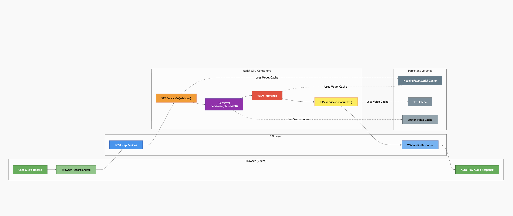

# ModalVoice

A fully self-hosted, voice-first AI assistant deployed on Modal.

ModalVoice is designed to feel like a real-time voice assistant while staying production-minded: it records speech in the browser, transcribes with Whisper, retrieves grounded context from Modal docs via vector search, generates answers with vLLM, synthesizes audio with open-source TTS, and returns audio-only responses.

The assistant is intentionally specialized for Modal topics (deployment, GPU workloads, autoscaling, functions, images, secrets, and operations).


---

## Core Capabilities

- Browser microphone input (`MediaRecorder`)
- Speech-to-text with Whisper on GPU
- Vector retrieval against Modal docs (`/docs`, `/docs/guide`, `/docs/examples`)
- Answer generation using vLLM + open-weight LLM
- Text-to-speech with Coqui TTS
- Audio-only response playback in browser
- Per-stage latency logging (`stt`, `rag`, `llm`, `tts`, `total`)

---

## End-to-End Flow



This diagram represents the complete runtime path:
- Browser capture -> API ingest
- STT (Whisper) -> RAG (Chroma) -> LLM (vLLM) -> TTS (Coqui)
- Audio-only response returned to browser
- Persistent caches (HF, TTS, RAG) used to reduce repeat latency

---

## Architecture 

### 1. `STTService` (`@app.cls`, GPU)
- Loads Whisper once in `@modal.enter()`
- Uses faster decode defaults for low latency
- Returns transcript + STT latency

### 2. `LLMService` (`@app.cls`, GPU)
- Loads vLLM model once in `@modal.enter()`
- Builds/loads Chroma vector index from Modal docs
- Retrieves top-k source snippets per query
- Generates answer strictly grounded in retrieved context
- Includes in-memory answer cache for repeated prompts

### 3. `TTSService` (`@app.cls`, GPU)
- Loads Coqui model once in `@modal.enter()`
- Synthesizes response to WAV
- Includes in-memory synthesis cache for repeated text

### 4. `web_app` (`@modal.asgi_app`)
- Serves minimal static UI
- Accepts uploaded audio
- Orchestrates STT -> RAG -> LLM -> TTS pipeline
- Returns `audio/wav` only

---

## Project Structure

```text
modal_voice/
  modal_app.py         # Modal app, services, API orchestration
  stt.py               # Whisper wrapper
  llm.py               # vLLM wrapper + output normalization
  tts.py               # Coqui TTS wrapper
  rag.py               # Chroma vector DB ingestion + retrieval
  prompts.py           # Modal-specialized prompt policy
  static/
    index.html         # Minimal UI shell
    styles.css         # Clean visual design
    app.js             # Record/send/autoplay behavior
  README.md
```

---

## Stack used

### Runtime & Orchestration
- [Modal](https://modal.com)
- Python 3.11
- FastAPI (ASGI endpoint)

### Speech-to-Text
- `faster-whisper`
- Whisper model (`tiny`/`small` configurable)

### Retrieval (RAG)
- `chromadb` (open-source, self-hosted in container)
- `sentence-transformers` embeddings (`all-MiniLM-L6-v2`)
- `requests` + `beautifulsoup4` for docs ingestion

### LLM Inference
- `vllm`
- Open-weight instruct model (default: `microsoft/Phi-3-mini-4k-instruct`)

### Text-to-Speech
- `TTS` (Coqui)
- Default voice model: `tts_models/en/ljspeech/vits`
- `espeak-ng` runtime dependency

---

## Scope

### In Scope
- Voice Q&A experience focused on Modal
- Grounded responses from indexed Modal docs
- Fully self-hosted inference on Modal
- Low-latency engineering via warm containers + caching

### Out of Scope
- General-purpose open-domain assistant behavior
- Persistent user chat history/memory
- Multi-user authentication and RBAC
- Bidirectional streaming audio protocol (current flow is request/response)

---

## How to Run

Assume `modal-voice` is the project root users run from.

```bash
git clone https://github.com/satyampsoni/modal-voice.git
cd modal-voice
python3 -m venv .venv
source .venv/bin/activate
pip install --upgrade pip
pip install -r requirements.txt
modal setup
modal serve modal_app.py
```

Open the `web_app` URL printed by Modal.

---

## Recommended Environment Configuration

```bash
export WHISPER_MODEL=tiny
export WHISPER_COMPUTE_TYPE=float16
export WHISPER_BEAM_SIZE=1

export VLLM_MODEL=microsoft/Phi-3-mini-4k-instruct
export VLLM_MAX_MODEL_LEN=2048
export VLLM_GPU_MEMORY_UTILIZATION=0.9
export VLLM_ENFORCE_EAGER=true
export VLLM_MAX_OUTPUT_TOKENS=120

export TTS_MODEL=tts_models/en/ljspeech/vits

export RAG_MAX_PAGES=50
export RAG_TOP_K=2
export RAG_CACHE_MAX_AGE_S=86400
```

Optional (faster model downloads):

```bash
export HF_TOKEN=<your_huggingface_token>
```

---

## Latency & Observability

Each request logs:

- `stt_latency_s`
- `rag_latency_s`
- `rag_hits`
- `llm_latency_s`
- `thinking_time_s` (= STT + LLM)
- `tts_latency_s`
- `total_latency_s`

Response headers include the same metrics (`x-*`) for client-side analysis.

---

## Operational Notes

- First run may be slower due to model/index initialization.
- GPU services are configured with warm containers to reduce cold starts.
- Model/index caches persist in Modal Volumes:
  - HuggingFace cache
  - TTS cache
  - RAG vector DB cache
- RAG retrieval context is treated as source-of-truth guidance for answers.

---

## Troubleshooting Quick Reference

### `ModuleNotFoundError` in Modal container
- Ensure dependency is installed in the correct Modal image (`.pip_install(...)`).

### `libcublas.so.12` not found
- Use NVIDIA CUDA base image for GPU inference containers.

### TTS error: `No espeak backend found`
- Install `espeak-ng` in container image.

### Slow first response
- Expected for cold start/model download.
- Verify warm containers and cache volumes are active.

### Inaccurate response
- Increase `RAG_TOP_K` slightly (e.g. 3–4)
- Rebuild or refresh RAG cache (`RAG_CACHE_MAX_AGE_S`)
- Adjust prompt policy in `prompts.py`

---

## Demo Questions

- What does Modal do, and when should I use it?
- How do `@app.function` and `@app.cls` differ?
- How do I run Whisper inference on Modal GPUs?
- How do `min_containers`, `max_containers`, and `scaledown_window` affect latency and cost?
- How do I cache model weights and avoid repeated cold starts?
